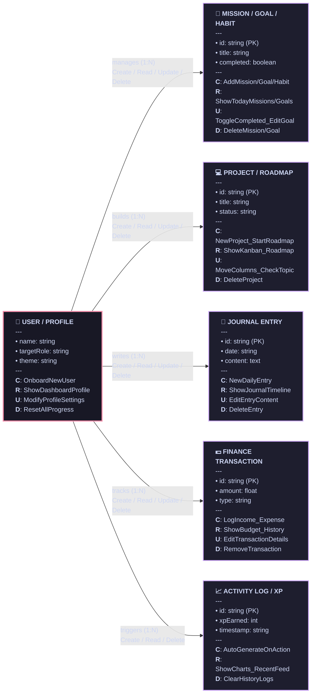

# LifeOS 365 Horizontal Logical ER Diagram (with CRUD Operations)

This document presents the horizontal layout of the simplified Entity-Relationship (ER) diagram for **LifeOS 365**. It uses a Mermaid `flowchart LR` structure to guarantee that the diagram renders horizontally from left to right across all preview systems.

---

## 1. Visual Simplified ER Diagram (Horizontal Layout)

---

## 2. CRUD Operations Mapping

Here is the functional breakdown of the CRUD actions represented in the ER diagram:

### 1. User / Settings
- **Create**: Triggered during the initial onboarding step (`onboarded = false` $\to$ `true`).
- **Read/Display**: Loaded globally to render the profile header, level badge, and selected theme (dark/light/accent colors).
- **Update**: Handled via the Profile page edit forms.
- **Delete**: A "Reset All Progress" action deletes all custom data, returning the schema to the initial default state.

### 2. Missions / Goals / Habits
- **Create**: Add custom tasks via the Missions form, set short/long-term Goals, or create Habits.
- **Read/Display**: Displayed on the Dashboard, Missions view, and Heatmap.
- **Update**: Check off completed items (awards XP and updates completion statistics), edit details, or archive items.
- **Delete**: Permanently delete a mission, habit, or goal.

### 3. Projects / Roadmap
- **Create**: Create new project cards on the Kanban board or begin topics on the career Roadmap.
- **Read/Display**: Renders Kanban columns (Todo, In Progress, Completed) and learning path maps.
- **Update**: Drag-and-drop status changes, increment progress percentages, or log active study hours.
- **Delete**: Permanently remove custom projects.

### 4. Journal Entries
- **Create**: Add daily written logs with mood descriptors and tags.
- **Read/Display**: Displayed on a reverse-chronological journal timeline feed.
- **Update**: Edit the body text or update the mood of a past entry.
- **Delete**: Remove a journal entry.

### 5. Finance Transactions
- **Create**: Add income items or log expenditures.
- **Read/Display**: Displayed on the Finance page with budget indicators and transactional tables.
- **Update**: Edit transaction value, date, or category.
- **Delete**: Delete a logged income/expense line item.

### 6. Activity Log / XP History
- **Create**: Automatically appended by the system backend whenever the user earns XP (completing habits, projects, or calendar check-ins).
- **Read/Display**: Feeds the Dashboard weekly activity charts and recent feeds.
- **Delete**: Clean/wipe old historical logs.
