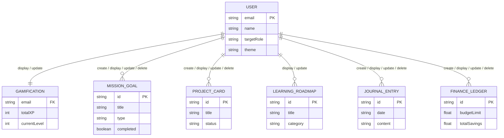

# Personal Growth Tracking System

Here is your simple and professional ER diagram showing the database entities and the CRUD relationships (create, display, update, delete) between them:

---

## 2. Detailed Entity & CRUD Operations Walkthrough

### 👤 User & Profile Settings (`USER`)
- **Role**: Serves as the central entity representing the user's progress state, profile metadata, and system preferences.
- **CRUD Operations**:
  - **Create**: Triggered once when the user completes onboarding, writing initial fields.
  - **Read/Display**: Renders user details, target roles, and college information on the profile page and dashboard header.
  - **Update**: Triggered when the user modifies profile fields, color schemas, or themes.
  - **Delete**: Toggles a total reset clearing the JSON database storage to initial onboarding state.

### 📈 Gamification Engine (`GAMIFICATION`)
- **Role**: Tracks progression, level status, accumulated XP points, and unlocked milestones/achievements.
- **CRUD Operations**:
  - **Read/Display**: Renders current level, XP ring, activity history graphs, and the achievements grid.
  - **Update**: Automatically increments XP points and unlocks milestones when other entities (missions, habits, goals, roadmap topics) trigger completion updates.

### 🎯 Daily Habits & Goals (`MISSION_GOAL`)
- **Role**: Manages custom daily tasks, recurrent habits, and long-term milestones.
- **CRUD Operations**:
  - **Create**: Add new daily missions, recurrent habits, or set goals with deadline targets.
  - **Read/Display**: Renders lists on the dashboard, checkboxes in quick widgets, and goal lists.
  - **Update**: Checking off items increments XP points, updates stats, and commits check-in days.
  - **Delete**: Clears custom missions or archived goals.

### 💻 Active Project Tracker (`PROJECT_CARD`)
- **Role**: Powers the portfolio projects Kanban board.
- **CRUD Operations**:
  - **Create**: Spawns a new project card with name, description, tech stack, and links.
  - **Read/Display**: Renders cards into columns (Todo, In Progress, Completed) and plots completed rates.
  - **Update**: Move card columns, edit properties, complete milestones, or log development hours.
  - **Delete**: Deletes a project card from the board.

### 📚 Learning Roadmap (`LEARNING_ROADMAP`)
- **Role**: Structures syllabus milestones (Frontend, Backend, Database, DSA) and tracks sub-topics.
- **CRUD Operations**:
  - **Read/Display**: Displays learning path modules, checklist topics, progress percentages, and next recommended study items.
  - **Update**: Checking off roadmap topics awards XP and updates module completion states.

### 📝 Daily Journaling (`JOURNAL_ENTRY`)
- **Role**: Logs daily written reflections, mood ratings, and tags.
- **CRUD Operations**:
  - **Create**: Creates daily text logs with mood levels (1-5 scale) and search tags.
  - **Read/Display**: Displays timeline lists and mood trend graphs.
  - **Update**: Edits the text content or mood emoji in past history entries.
  - **Delete**: Deletes logs from history.

### 💵 Personal Finance (`FINANCE_LEDGER`)
- **Role**: Tracks incoming streams, expenditures, and monthly budget limits.
- **CRUD Operations**:
  - **Create**: Logs new income sources or categorizes spending (Food, Transport, Utilities, etc.).
  - **Read/Display**: Shows balance stats, income vs expense charts, and transaction feeds.
  - **Update**: Modifies values, dates, or classifications of transactions.
  - **Delete**: Removes selected transaction logs.
