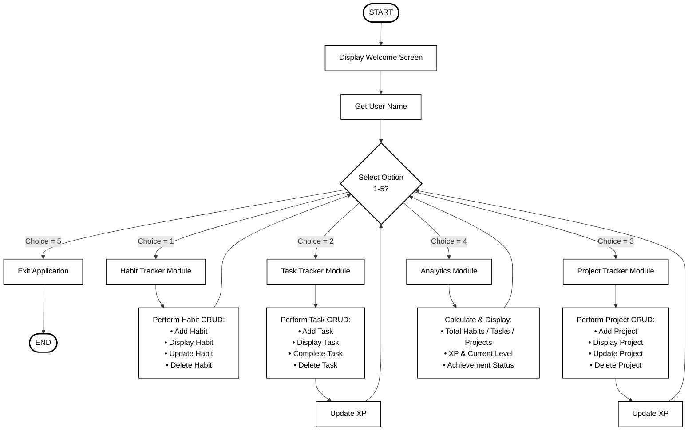

# Flowchart: LIFEOS 365 – Personal Growth Tracking System

This document contains the system flowchart for the LIFEOS 365 application. 

Standard ISO software engineering flowchart symbols are used:
* **Oval (Stadium)**: Start / End of program.
* **Rectangle**: Processing steps (welcome, inputs, operations).
* **Diamond**: Decision branching (Main Menu selection).
* **Arrows**: Direction of control flow.

---

## 1. Vector Flowchart (Mermaid.js Format)

The diagram below renders dynamically as a vector graphic. 

> [!TIP]
> **To export this flowchart in high resolution for your report:**
> 1. Copy the code block above.
> 2. Paste it into the free [Mermaid Live Editor (mermaid.live)](https://mermaid.live).
> 3. Click **Actions** -> **PNG** or **SVG** to download the diagram in ultra-high resolution.

---

## 2. Pre-rendered Graphic Asset

Below is a generated high-resolution visual representation of the flowchart for direct use.

